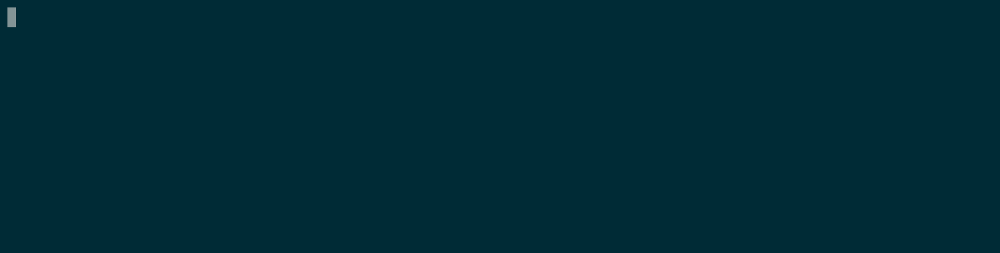

# Tutorial básico de Kubernetes

**Kubernetes** es un orquestador de servicios para su gestión y despliegue en infraestructuras de alto rendimiento.

**Minikube** es un cluster **kubernetes** con **un solo** nodo. Está pensado para desplegarlo como entorno de pruebas y aprendizaje. Se puede instalar en todos los sistemas operativos y el [proceso de instalación](https://kubernetes.io/es/docs/tasks/tools/install-minikube/) es bastante sencillo. Lo que hace es crear una máquina virtual donde se instala una versión reducida de **kubernetes**.

Una vez instalado, podemos arrancar el cluster con el comando:

```shell
    minikube start
```



Una vez arrancado el cluster, **minikube** nos deja `kubectl` ya configurado para controlarlo. Puedes comprobar que la configuración automática es correcta pidiendo, por ejemplo, información sobre los nodos que forman el cluster:

```shell
    kubectl get nodes
```

**Minikube** trae incorporado un panel de mandos gráfico al cual se puede acceder a través de un navegador. Para habilitarlo, basta con ejecutar el siguiente comando:

```shell
    minikube dashboard
```

El comando abrirá la URL correspondiente en el navegador. Como puedes comprobar, este comando se queda ejecutándose en primer plano mientras pretendas usar el *dashboard*. Para salir, bastará con pulsar `CTRL+C` en la línea de comandos.

## Desplegando un primer servicio: hello-minikube

Vamos a crear un despliegue de un servicio *de juguete* que se llama `echoserver`. Este despliegue es el típico servicio inicial para comprobar la configuración del cluster. Este despliegue está definido para ofrecer servicio en el puerto `8080`. Vamos a crear el despliegue usando `kubectl`:

```shell
    kubectl create deployment hello-minikube --image=k8s.gcr.io/echoserver:1.10
```

Como se puede observar, estamos indicando explícitamente la imagen del único contenedor que forma parte del *Pod* que se define en este despliegue. Además, al no proporcionar parámetros adicionales, el despliegue está definiendo por defecto que desea **una** única réplica de dicho *Pod*.

### Despliegues

Un **deployment** especifica el estado deseado en el cluster con respecto a alguna determinada aplicación. Incluye información sobre el número de réplicas de los *Pods* de dicha aplicación, así como la plantilla para construir dichos *Pods*. Esta plantilla tiene un formato parecido a un `docker-compose.yml`, es decir, se especifican los contenedores y sus configuraciones que irán en un *Pod*.

El cluster ya ha lanzado el número de *Pods* deseados en el despliegue que acabamos de crear. Podemos comprobarlo consultando los *Pods* activos en el cluster:

```shell
    kubectl get pods
```

Observamos que el despliegue solo ha solicitado que haya **una** réplica del *Pod*, por eso nos ha devuelto `1/1` el comando. Aunque se estén ejecutando los contenedores, el *Pod* correspondiente no está expuesto hacia el exterior del cluster, por lo que no podemos acceder a él. Para ello tenemos que decirle a **kubernetes** que queremos exponer ese servicio al exterior:

```shell
    kubectl expose deployment hello-minikube --type=NodePort --port=8080
```

Lo que va a hacer **kubernetes** es generar una URL propia para el servicio que acabamos de exponer, y la red redireccionará las peticiones que se hagan a esta URL hacia el puerto `8080` del *Pod*. Hay que destacar que en el caso de que el despliegue tuviese configurada más de una réplica del *Pod*, **kubernetes** es capaz de hacer un balanceo de carga entre todos ellos. Podemos obtener la URL que se ha generado preguntándole a **minikube**:

```shell
    minikube service hello-minikube --url
```

Si accedemos a la URL que nos devuelve el comando anterior podremos observar que el servicio se ha desplegado correctamente y, además, está expuesto al exterior, puesto que hemos podido acceder a él desde fuera del cluster.

### Despliegues mediante *templates*

Antes hemos creado y lanzado un despliegue especificándolo directamente en el comando correspondiente de `kubectl`. Para despliegues sencillos es una opción válida, aunque en la práctica se utilizan los despliegues definidos mediante un *template* en *YAML*. Estos *templates* se parecen en cierta medida a los ficheros `docker-compose.yml` que se utilizan para definir la infraestructura de la aplicación cuando usamos **Docker-compose**.

A continuación vamos a realizar el despliegue de una aplicación web que es un libro de visitas. Este ejemplo forma parte de la documentación oficial de **Kubernetes**, y se puede encontrar en [GitHub](https://github.com/kubernetes/examples/tree/master/guestbook) y en la [documentación](https://kubernetes.io/docs/tutorials/stateless-application/guestbook/). La aplicación está formada por los siguientes componentes:

- Una instancia de la [base de datos clave-valor Redis](https://redis.io/) que actúa como almacén de las visitas (solo escrituras).
- Varias instancias de [Redis](https://redis.io/) para resolver las consultas de datos de manera escalable (solo lecturas).
- Varias instancias del *frontend* de la aplicación, sirviendo una web hecha con PHP.

Como podemos observar, la aplicación se puede dividir en tres despliegues: el Redis para escrituras, los Redis para lecturas y las instancias de servidores web sirviendo el *frontend*.

A continuación se puede observar el *template* para el despliegue del nodo maestro de Redis para las escrituras, el cual se puede obtener directamente de: [https://github.com/kubernetes/examples/blob/master/guestbook/redis-master-deployment.yaml](https://github.com/kubernetes/examples/blob/master/guestbook/redis-master-deployment.yaml)

```yaml
    apiVersion: apps/v1
    kind: Deployment  # Especifica el tipo de template (Despliegue en este caso)
    metadata:
      name: redis-master  # Le asignamos un nombre al despliegue
    spec:  # Aquí empieza el estado deseado del despliegue que estamos definiendo
      selector:
        matchLabels:   # Metadatos para poder referirnos a este despliegue posteriormente
          app: redis
          role: master
          tier: backend
      replicas: 1      # Número de instancias deseadas (solo una para escrituras)
      template:        # Aquí se define el Pod que luego se replicará según el valor anterior
        metadata:
          labels:
            app: redis
            role: master
            tier: backend
        spec:  # Contenedores y resto de elementos que irán en el Pod
          containers:     # Esto se parece mucho a los services: de un docker-compose.yml
          - name: master
            image: k8s.gcr.io/redis:e2e
            resources:
              requests:
                cpu: 100m
                memory: 100Mi
            ports:
            - containerPort: 6379
    # Puedes observar que los Pods de este despliegue están formados por un único contenedor
```

Para lanzar este despliegue en el cluster, vamos a hacer uso de `kubectl` y le especificaremos donde puede encontrar el fichero YAML. En este caso podemos pasarle directamente la URL de GitHub donde se encuentra el *template*, teniendo cuidado de enlazar la versión *raw* del mismo:

```shell
    kubectl apply -f https://raw.githubusercontent.com/kubernetes/examples/master/guestbook/redis-master-deployment.yaml
```

Recuerda que puedes comprobar los despliegues y pods que hay en el cluster con `kubectl get deployments` y `kubectl get pods` respectivamente.

Aunque la instancia de Redis está funcionando, se encuentra dentro de un *Pod* que no tiene comunicación con el exterior. Sin embargo, la aplicación del libro de visitas necesita comunicarse con Redis para guardar la información que vayan introduciendo los usuarios, por lo que Redis deberá estar accesible desde otros *Pods*. Tenemos que definir un **Servicio** de **kubernetes**, que no es otra cosa que definir la política de acceso a los *Pods* que tengamos en el cluster. El siguiente *template* se corresponde con un servicio para que sea posible acceder al contenedor que tiene el Redis maestro:

```yaml
    apiVersion: v1
    kind: Service      # Esta plantilla define un servicio, no un despliegue
    metadata:
      name: redis-master
      labels:
        app: redis
        role: master
        tier: backend
    spec:
      ports:
      - port: 6379        # Puerto externo del Pod para recibir peticiones...
        targetPort: 6379  # ...que se redirigen a este puerto interno de un contenedor
      selector:           # ¿A qué Pods puedo redirigir las peticiones?
        app: redis
        role: master
        tier: backend
```

Este servicio funciona de la siguiente manera:

- Se crea una dirección interna en el cluster para este servicio, que responde a las peticiones en el puerto `6379`.
- Cada petición que llega a ese puerto es redireccionada mediante el balanceador de carga automáticamente al puerto especificado en `targetPort` de aquellos *Pods* que cumplan con el criterio definido en el `selector`, es decir, aquellos cuyos campos `app`, `role` y `tier` tengan los valores `redis`, `master` y `backend`, respectivamente
- Fíjate que esos valores los definimos en la plantilla del despliegue, por lo que todas las peticiones a este servicio se redirigirán al único *Pod* que tenemos con Redis (se definió `replicas: 1` en el despliegue).

Una vez tenemos la plantilla del servicio, podemos lanzarlo en el cluster de la misma forma que el despliegue usando `kubectl`:

```shell
    kubectl apply -f https://raw.githubusercontent.com/kubernetes/examples/master/guestbook/redis-master-service.yaml
```

Si preguntamos al cluster por los servicios que hay desplegados con `kubectl get services` obtenemos el siguiente listado:

```text
    NAME             TYPE        CLUSTER-IP     EXTERNAL-IP   PORT(S)          AGE
    hello-minikube   NodePort    10.99.158.40   <none>        8080:30574/TCP   15h
    kubernetes       ClusterIP   10.96.0.1      <none>        443/TCP          42h
    redis-master     ClusterIP   10.107.137.5   <none>        6379/TCP         26s
```

Observa que a nuestro flamante servicio `redis-master` se le ha asignado una IP virtual dentro del cluster. Sin embargo, a diferencia de `hello-minikube`, no podemos pedirle a **minikube** que nos devuelva la URL correspondiente al nuevo servicio, ya que no es de tipo `NodePort` y, por tanto, tampoco es accesible desde fuera. Si quieres saber los tipos de servicios que se pueden crear en el cluster, echa un vistado a la [documentación oficial](https://kubernetes.io/docs/concepts/services-networking/service/#publishing-services-service-types) al respecto.

El siguiente paso es lanzar tanto el despliegue como el servicio correspondiente a las instancias de Redis que se van a encargar de las lecturas. El *template* correspondiente al despliegue es el siguiente:

```yaml
    apiVersion: apps/v1
    kind: Deployment
    metadata:
      name: redis-slave
    spec:
      selector:
        matchLabels:
          app: redis
          role: slave
          tier: backend
      replicas: 2     # Observa que vamos a desplegar dos instancias
      template:
        metadata:
          labels:
            app: redis
            role: slave
            tier: backend
        spec:
          containers:
          - name: slave
            image: gcr.io/google_samples/gb-redisslave:v1
            resources:
              requests:
                cpu: 100m
                memory: 100Mi
            env:
            - name: GET_HOSTS_FROM # Esta variable de entorno la usamos para saber el host del Redis Master
              value: dns           # Además sacaremos el host del servidor DNS interno que monta Kubernetes
            ports:
            - containerPort: 6379
```

Análogamente, el *template* para el servicio es:

```yaml
    apiVersion: v1
    kind: Service
    metadata:
      name: redis-slave
      labels:
        app: redis
        role: slave
        tier: backend
    spec:
      ports:
      - port: 6379
      selector:
        app: redis
        role: slave
        tier: backend
```

Lanzamos el despliegue y el servicio invocando a `kubectl`:

```shell
    kubectl apply -f https://raw.githubusercontent.com/kubernetes/examples/master/guestbook/redis-slave-deployment.yaml
    kubectl apply -f https://raw.githubusercontent.com/kubernetes/examples/master/guestbook/redis-slave-service.yaml
```

El último paso que nos queda es lanzar el despliegue del *frontend* así como el servicio asociado al mismo. El *template* del despliegue es el siguiente:

```yaml
    apiVersion: apps/v1
    kind: Deployment
    metadata:
      name: frontend
    spec:
      selector:
        matchLabels:
          app: guestbook
          tier: frontend
      replicas: 3
      template:
        metadata:
          labels:
            app: guestbook
            tier: frontend
        spec:
          containers:
          - name: php-redis
            image: gcr.io/google-samples/gb-frontend:v4
            resources:
              requests:
                cpu: 100m
                memory: 100Mi
            env:
            - name: GET_HOSTS_FROM
              value: dns
            ports:
            - containerPort: 80
```

Y el *template* del servicio:

```yaml
    apiVersion: v1
    kind: Service
    metadata:
      name: frontend
      labels:
        app: guestbook
        tier: frontend
    spec:
      type: NodePort # ¡DETALLE IMPORTANTE: NodePort para acceder al servicio desde fuera!
      ports:
      - port: 80
      selector:
        app: guestbook
        tier: frontend
```

Las últimas invocaciones a `kubectl` y el *frontend* estará en marcha:

```shell
    kubectl apply -f https://raw.githubusercontent.com/kubernetes/examples/master/guestbook/frontend-deployment.yaml
    kubectl apply -f https://raw.githubusercontent.com/kubernetes/examples/master/guestbook/frontend-service.yaml
```

Esperamos a que estén levantadas las instancias del *frontend*, podemos consultar su estado con el comando `kubectl get deployments`, que nos devuelve la información de forma tabulada:

```text
    NAME             READY   UP-TO-DATE   AVAILABLE   AGE
    frontend         3/3     3            3           90s
    hello-minikube   1/1     1            1           16h
    redis-master     1/1     1            1           45m
    redis-slave      2/2     2            2           10m
```

Por último, para ver la aplicación en funcionamiento podemos pedir la URL de acceso al servicio a **minikube**  y apuntar el navegador a la misma:

```shell
    minikube service frontend --url
```

Imagina que nuestra aplicación empieza a tomar notoriedad, y las dos réplicas del *frontend* empiezan a quedarse cortas. Podemos escalar el despliegue correspondiente al *frontend* con un simple comando:

```shell
    kubectl scale deployment frontend --replicas=4
```

Si miramos los *deployments* con `kubectl get deployments` observaremos que hay desplegados 4 *Pods*. Podemos ver la información individual de cada *Pod* con `kubectl get pods`.

## Volúmenes para persistencia

Todo lo que hemos hecho hasta ahora no ha hecho uso de la persistencia, por lo que internamente se han estado utilizando volúmenes efímeros. **Kubernetes** proporciona varios mecanismos para dotar de persistencia a los volúmenes que usan los *Pods*. Uno de esos mecanismos es el uso de lo que en **kubernetes** se conoce como `PersistentVolume`. Estos volúmenes son independientes del ciclo de vida de los *Pods*, por lo que preservan la información aunque se reinicien o eliminen los *Pods* que los usan.

Para ilustrar el uso de este tipo de volúmenes, vamos a lanzar en el clúster una aplicación Wordpress como la que ya lanzamos cuando trabajábamos con **docker-compose**. Recuerda que esa infraestructura estaba formada por dos contenedores: uno con la imagen de *MySQL* y otro con la imagen oficial de *Wordpress* que se encuentra en *DockerHub*. Por lo tanto necesitamos dos despliegues en **kubernetes**, uno para la base de datos (*backend*) y otro para el *Wordpress* propiamente dicho (*frontend*).

En el repositorio de la asignatura puedes encontrar los *templates* tanto para los despliegues como para los servicios. Además, aprovechando la posibilidad que nos da el formato YAML de incluir varios documentos en el mismo fichero (usando el separador `---`), he agrupado todo en dos ficheros, uno para todo lo relacionado con el *[backend](wordpress/backend.yml)* y otro para el *[frontend](wordpress/frontend.yml)*.

Es importante destacar que para que un *Pod* pueda acceder a un volumen con persistencia hay que crear un componente **kubernetes** que se conoce como **PersistentVolumeClaim**. En su *template* correspondiente se pueden configurar cosas como el tipo de acceso o el almacenamiento en disco máximo que se le otorga al volumen persistente.

Para levantar todo lo relacionado con el *backend*, es decir, el servidor de base de datos MySQL bastará con usar `kubectl` y pasarle los *templates* correspondientes que están en el fichero `backend.yml`. Suponiendo que estamos en el directorio del repositorio donde se encuentran estos ficheros, el comando:

```shell
    kubectl apply -f backend.yml
```

levanta el servicio para la base de datos que usará Wordpress para funcionar, crea un volumen persistente y lanza el despliegue de la base de datos. Comprobamos que todo haya funcionado bien con `kubectl get deployments`:

```text
    NAME              READY   UP-TO-DATE   AVAILABLE   AGE
    wordpress-mysql   1/1     1            1           3m43s
```

que nos muestra que el despliegue se ha realizado correctamente, y con `kubectl get services`:

```text
    NAME              TYPE        CLUSTER-IP   EXTERNAL-IP   PORT(S)    AGE
    kubernetes        ClusterIP   10.96.0.1    <none>        443/TCP    51m
    wordpress-mysql   ClusterIP   None         <none>        3306/TCP   4m25s
```

donde podemos observar que el servicio `worpress-mysql` también está levantado.

Análogamente podemos levantar todo lo relacionado con el *frontend* de la misma forma, solo que en esta ocasión le pasaremos a `kubectl` el archivo correspondiente `frontend.yml`:

```shell
    kubectl apply -f frontend.yml
```

Una vez hayas comprobado que todo se ha levantado correctamente con los mismos comandos que hemos usado antes, puedes pedirle a **minikube** la URL en la que se puede acceder a la aplicación:

```shell
    minikube service wordpress --url
```

Si accedes a la URL verás que tienes disponible Wordpress para que hagas la configuración inicial. Prueba a eliminar *Pods* para comprobar que los datos se mantienen en los volúmenes persistentes una vez se ha vuelto a lanzar el *Pod*.

## Detalles adicionales

A continuación puedes encontrar otros aspectos de **Kubernetes** que, si bien quedan fuera del ámbito de la asignatura, puedes investigar y probar por tu cuenta.

- Todos los ejemplos que hemos tratado se basan en imágenes de contenedores alojadas en un registro accesible desde el cluster. Si quieres trabajar con imágenes de contenedores personalizadas tienes varias opciones, aunque la más recomendable es subir la imagen a *DockerHub* con `docker push` una vez se haya construido correctamente con `docker build`. Si te preocupa que las imágenes subidas a *DockerHub* son públicas, siempre puedes [configurar un registro privado de imágenes de contenedor](https://docs.docker.com/registry/deploying/) y configurar **kubernetes** para que lo use a la hora de desplegar los *Pods*.
- En el ejemplo de *Wordpress* hemos puesto información muy sensible directamente en el fichero YAML, como las contraseñas para la base de datos. Esta práctica está **completamente desaconsejada** para entornos de producción. **Kubernetes** puede gestionar de forma automática la asignación de información secreta a variables de entorno mediante *[Secrets](https://kubernetes.io/docs/concepts/configuration/secret/)*.
